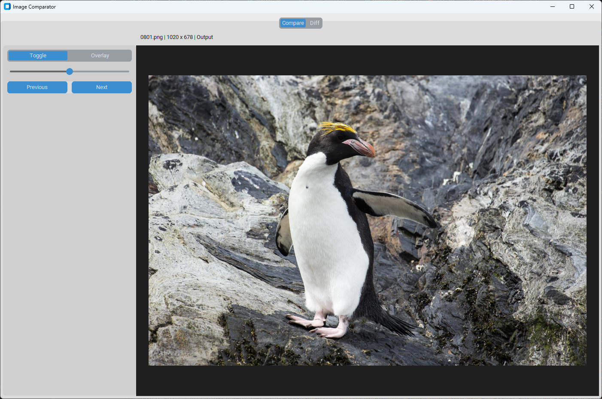

# Up-res QA tool
I made a similar tool when I was working as Technical ML Product Manager in a computer vision start-up. There was no pipeline in place nor tools to assess the quality of our outputs, so I built something myself and used this opportunity to learn Python. 

# Features
- Define input and output folders for image comparisons
- Pressing I/O toggles input/output to easily compare the quality between both images (the [Lanczos](https://en.wikipedia.org/wiki/Lanczos_algorithm) algorithm is used for comparing both images at the same resolution)
- Space bar to reset the canva viewport
- Multiple view methods: Toggle or Overlay with a selector to set the limit between both images
- Coming soon: difference map generator to standardize quality errors assessments

# Screenshot

# References and external links
The images used as samples are taken from the Div2K library: https://data.vision.ee.ethz.ch/cvl/DIV2K/.